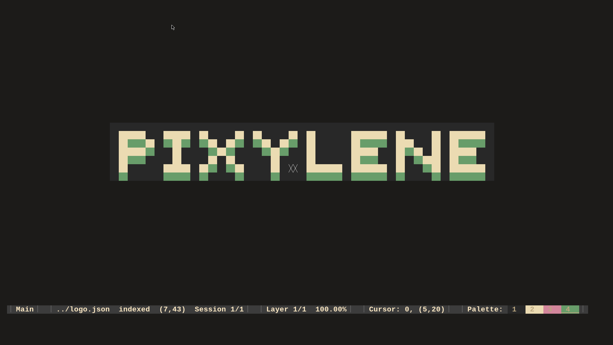

# Pixylene
An extensible pixel art editor.

**Notice:** This application is still in very early stages, lacks basic features, lacks a manual, and is generally very not-fun to use.
Please refer to this incomprehensible [roadmap](./notes.org).

Pixylene should run on Linux, Windows & MacOS but has only been tested on Linux & Windows


# Screenshot



# Prerequisites
- Cargo is required to manage dependencies


# Clone
``` sh
git clone https://github.com/bhavyakukkar/pixylene.git
cd pixylene
```


# Build
There are 4 targets available:

1. TUI (runs in the terminal using `crossterm`)
This is the preferred editor (preferred over gui).
```sh
make tui
```
2. Web (runs in the browser in the form of `wasm`)
```sh
make web
```
3. GUI (runs in a standalone window using `minifb`)
```sh
make gui
```
4. CLI (runs in any stream)
This is preferred if you want to pipe pixylene into some other program like this
[example](./examples/cli.py)
```sh
make cli
```

- Lua can be enabled in any of the targets except Web by prefixing the command like so:
```sh
LUA=,lua make tui
LUA=,lua make gui
LUA=,lua make cli
```

- `tui`, `gui` & `cli` will be built to `target/release/` as pixylenetui, pixylenegui, pixylenecli
  respectively
- `web` will be built and packaged right in `pixylene-ui/` where it can be served using an HTTP/S
  server
```sh
cd pixylene-ui
python -m http.server 6969
mybrowser localhost:6969/
```


# Usage
```sh
# start the editor
pixylenetui

# start with a new project with default dimensions and true canvas
pixylenetui new

# start with a new project with 16x16 true canvas
pixylenetui new 16 16

# start with a new project with 16x16 indexed canvas
pixylenetui new 16 16 -i

# start with a new project from a png
pixylenetui import test.png

# start with a new project from a png downscaled to 32x32
pixylenetui import test.png 32 32

# start with a saved canvas file (plaintext)
pixylenetui canvas ~/canvas.json

# start with a saved project file (binary)
pixylenetui project ~/project.pixylene
```


# Configuration
Pixylene is configured in 2 different ways:


## Custom Actions [Lua]
- Custom Actions can be written using Pixylene's Lua API.
- The file containing these custom actions must be named `actions.lua` and located in your
  platform-specific [configuration directory](https://docs.rs/dirs/latest/dirs/fn.config_dir.html)
- [Examples](./pixylene-ui/src/std-actions.lua)

### Build Lua API Docs
- The Lua reference API can be generated using
  [tealr_doc_gen](https://github.com/lenscas/tealr_doc_gen):
```sh
# make sure tealr_doc_gen is installed globally
#cargo install tealr_doc_gen
make lua-docs
```

- The documentation pages will be built to assets/docs/pixylene-lua/pages


## Static Editor Configuration [TOML]
- Static Configuration of the editor, including all keybindings & modes, can be written in TOML.
- The config file must be named `config.toml` and located in your platform-specific
  [configuration directory](https://docs.rs/dirs/latest/dirs/fn.config_dir.html)
- [Example](./examples/config.toml)
