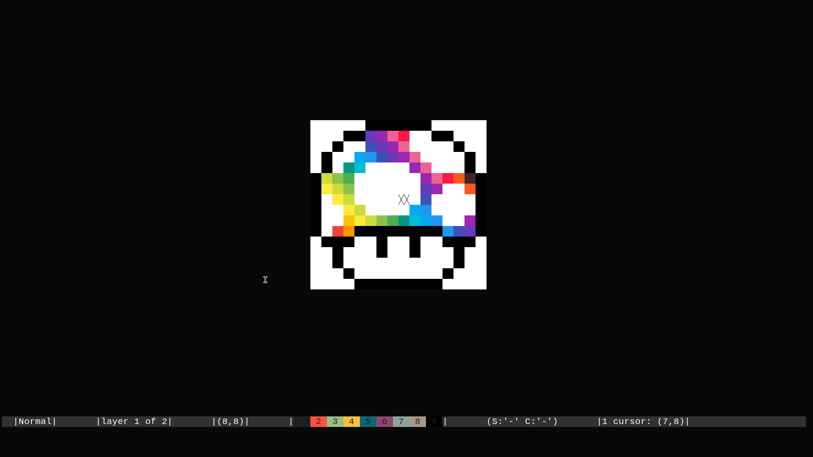

# Pixylene
An extensible pixel art editor.

**Notice:** This application is still in very early stages, lacks basic features, lacks a manual, and is generally very not-fun to use.
Please refer to this incomprehensible [roadmap](./libpixylene/src/notes.org).


# Build
## Prerequisites
- Cargo is required to manage dependencies

## Clone
``` sh
git clone https://github.com/bhavyakukkar/pixylene.git
cd pixylene
```

## Build TUI [runs in the terminal] (uses `crossterm`)
This is the preferred editor (preferred over the Windowed build)

```sh
cargo build -p pixylene-ui --release \ 
    --bin pixylenetui
```

## Build GUI [runs in a standalone window] (uses `minifb`)
This is the less preferred editor

```sh
cargo build -p pixylene-ui --release \ 
    -F minifb \  # to enable minifb dependency made optional
    --bin pixylenegui
```

## Build CLI [runs in any stream]
This is preferred if you want to pipe pixylene into some other program

```sh
cargo build -p pixylene-ui --release\ 
    --bin pixylenecli
```

All executables will be built to `target/release/`


# Usage
``` sh
# new project
pixylenetui new

# new project from png
pixylenetui import test.png

# open saved project
pixylenetui open ~/project.pi
```


# Screenshots

