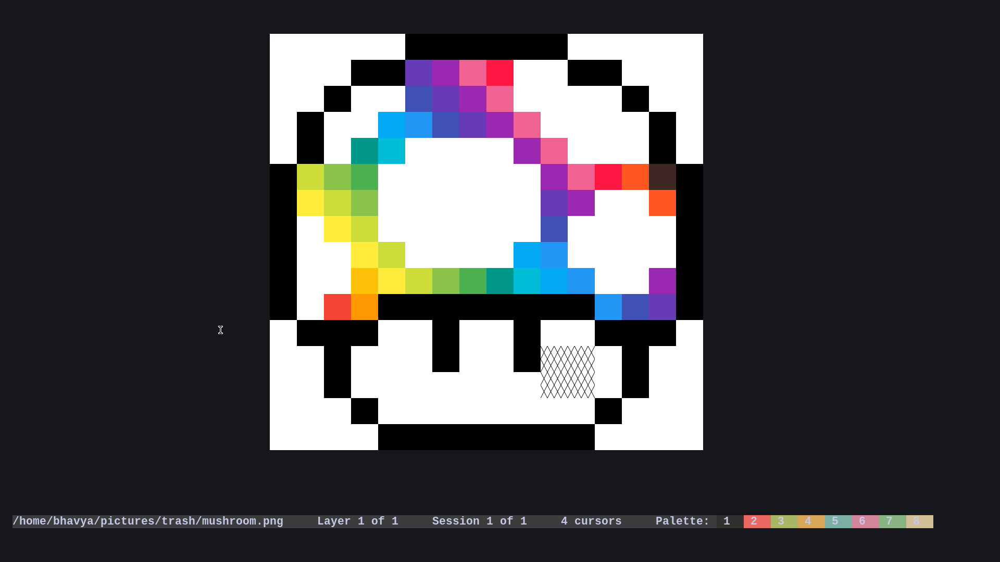

# Pixylene
An extensible pixel art editor.

**Notice:** This application is still in very early stages, lacks basic features, lacks a manual, and is generally very not-fun to use.
Please refer to this incomprehensible [roadmap](./notes.org).

Pixylene should run on Linux, Windows & MacOS but has only been tested on Linux & Windows


# Screenshot



# Build
## Prerequisites
- Cargo is required to manage dependencies

## Clone
``` sh
git clone https://github.com/bhavyakukkar/pixylene.git
cd pixylene
```

## Build TUI [runs in the terminal] (uses `crossterm`)
This is the preferred editor (preferred over the Windowed build)

```sh
cargo build -p pixylene-ui --release \ 
    --bin pixylenetui
```

## Build GUI [runs in a standalone window] (uses `minifb`)
This is the less preferred editor

```sh
cargo build -p pixylene-ui --release \ 
    -F minifb \  # to enable minifb dependency made optional
    --bin pixylenegui
```

## Build CLI [runs in any stream]
This is preferred if you want to pipe pixylene into some other program like this [example](./examples/cli.py)

```sh
cargo build -p pixylene-ui --release \ 
    --bin pixylenecli
```

All executables will be built to `target/release/`


# Usage
```sh
# new project with 16x16 true canvas
pixylenetui new 16 16

# new project with 16x16 indexed canvas
pixylenetui new 16 16 -i

# new project from png downscaled to 32x32
pixylenetui import test.png 32 32

# open saved canvas file (plaintext)
pixylenetui canvas ~/canvas.json

# open saved project file (binary)
pixylenetui project ~/project.pixylene
```


# Configuration
Pixylene is configured in 2 different ways:


## Custom Actions [Lua]
- Custom Actions can be written using Pixylene's Lua API.
- The file containing these custom actions must be named `actions.lua` and located in your [configuration directory](https://docs.rs/dirs/latest/dirs/fn.config_dir.html)
- [Example File](./examples/actions.lua)

### Build Lua API Docs
- The Lua API documentation can be created using [tealr_doc_gen](https://github.com/lenscas/tealr_doc_gen):
```sh
# generate pixylene-lua API json into assets/docs/pixylene-lua
cargo run -p pixylene-lua -F docs -- ./assets/docs/pixylene-lua/pixylene-lua.json

# navigate to doc root
cd ./assets/docs/pixylene-lua

# install tealr_doc_gen globally
cargo install tealr_doc_gen

# create the docs
~/.cargo/bin/tealr_doc_gen run
```
- The documentation pages will be built to assets/docs/pixylene-lua/pages


## Static Editor Configuration [TOML]
- Static Configuration of the editor, including all keybindings & modes, can be written in TOML.
- The config file must be named `config.toml` and located in your [configuration directory](https://docs.rs/dirs/latest/dirs/fn.config_dir.html)
- [Example File](./examples/config.toml)
